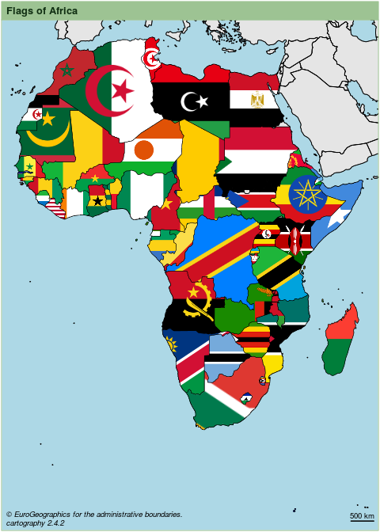
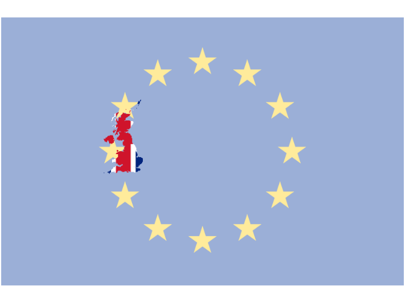
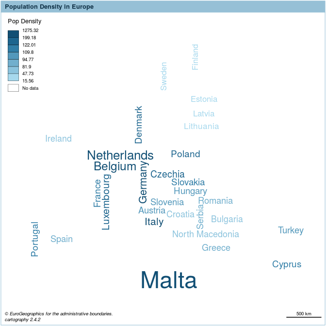
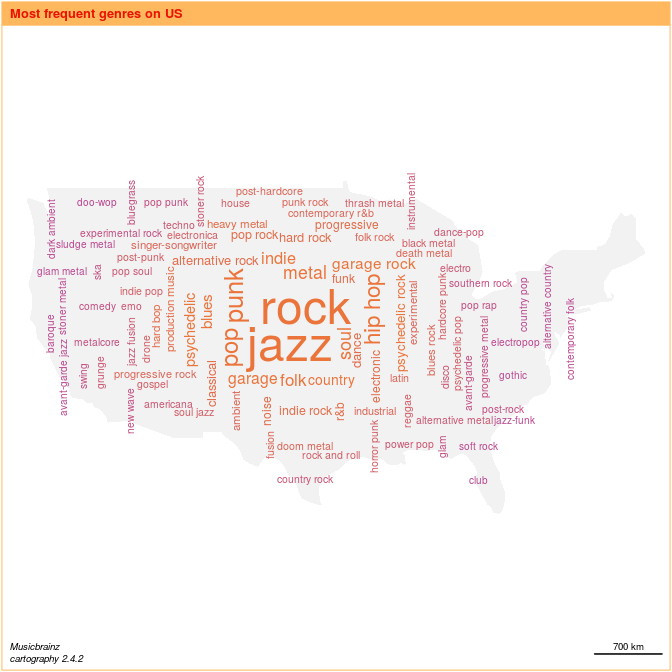

## Introduction

The aim of this document is to describe the new features added to
`cartography` on version `2.4.0` by
[dieghernan](https://github.com/dieghernan/) and already available on
**CRAN**.

Those new features are:

  - `hatchedLayer` and `legendHatched` functions.
  - `pngLayer` and `getPngLayer` functions.
  - `wordcloudLayer` function.

These functions don’t handle `sp` objects on purpose, favoring `sf`
instead.

## Installation

``` r
#install.packages("cartography")
library(cartography)
packageVersion("cartography")
## [1] '2.4.2'
```

## Hatched Map

Version of typology/choropleth maps using a hatched filling. This is
particularly useful for those maps that needs to be printed on black and
white, as academic papers. These maps also are useful for representing
overlapping dimensions.

### Example 1

``` r
library(sf)
## Linking to GEOS 3.5.1, GDAL 2.2.2, PROJ 4.9.2
library(jsonlite)
library(dplyr)
## 
## Attaching package: 'dplyr'
## The following objects are masked from 'package:stats':
## 
##     filter, lag
## The following objects are masked from 'package:base':
## 
##     intersect, setdiff, setequal, union

#Shape
cntries = st_read("https://ec.europa.eu/eurostat/cache/GISCO/distribution/v2/countries/geojson/CNTR_RG_20M_2016_3035.geojson",
                  stringsAsFactors = FALSE)
## Reading layer `CNTR_RG_20M_2016_3035' from data source `https://ec.europa.eu/eurostat/cache/GISCO/distribution/v2/countries/geojson/CNTR_RG_20M_2016_3035.geojson' using driver `GeoJSON'
## Simple feature collection with 257 features and 6 fields
## geometry type:  MULTIPOLYGON
## dimension:      XY
## bbox:           xmin: -7142317 ymin: -9160665 xmax: 16932290 ymax: 15428010
## CRS:            3035

# Include trade blocks
df <- fromJSON("https://raw.githubusercontent.com/dieghernan/Country-Codes-and-International-Organizations/master/outputs/Countrycodesfull.json")
ISO_memcol <- function(df,
                       orgtosearch) {
  ind <- match(orgtosearch, unlist(df[1, "org_id"]))
  or <- lapply(1:nrow(df), function(x)
    unlist(df[x, "org_member"])[ind])
  or <- data.frame(matrix(unlist(or)), stringsAsFactors = F)
  names(or) <- orgtosearch
  df2 <- as.data.frame(cbind(df, or, stringsAsFactors = F))
  return(df2)
}
df <- ISO_memcol(df, "EU")
df <- ISO_memcol(df, "EFTA")
df <- ISO_memcol(df, "EuroArea")


cntries = merge(cntries,
                df,
                by.x = "ISO3_CODE",
                by.y = "ISO_3166_3",
                all.x = TRUE)

library(cartography)


#Limits EU
#Plot base map
plot(
  st_geometry(cntries),
  xlim = c(2200000, 7150000),
  ylim = c(1380000, 5500000),
)
plot(st_geometry(cntries), add = TRUE)
plot(st_geometry(cntries[!is.na(cntries$EU),]), col = "grey60", add = TRUE)
plot(st_geometry(cntries[!is.na(cntries$EFTA),]), col = "black", add = TRUE)
#Add hatching
hatchedLayer(
  cntries[!is.na(cntries$EuroArea),],
  pattern = "right2left",
  col = "white",
  density = 3,
  add = TRUE
)
legendTypo(
  "topright",
  title.txt = "",
  categ = c("EU", "EFTA"),
  col = c("grey60", "black"),
  nodata = FALSE
)

legendHatched(
  "right",
  title.txt = "Within EU",
  categ = "Euro\nArea",
  patterns = "right2left",
  frame = TRUE
)
layoutLayer(
  title = "European Trade Blocks",
  theme = "grey.pal",
  sources = "© EuroGeographics for the administrative boundaries.",
  author =  paste0("cartography ", packageVersion("cartography")),
  scale = 500,
  frame = TRUE
)
```

<!-- -->

### Example 2

``` r
library(sf)
library(cartography)

# Plot World
plot(
  cntries$geometry,
  col = "white",
  xlim = c(2200000, 7150000),
  ylim = c(1380000, 5500000),
)
#Add layers for non european area - left2right
NOEUR = subset(cntries, CONTINENT.EN != "Europe" | is.na(CONTINENT.EN))
hatchedLayer(
  NOEUR,
  pattern = "left2right",
  add = TRUE,
  #Basic usage
  density = 2,
  #Densify default grid
  lwd = 1.2,
  lty = 3,
  col = "grey50"
)            #Formatting

#Extract Europe Regions
EUR = subset(cntries, CONTINENT.EN == "Europe" & SUBREGION.EN != "Western Asia")[, "SUBREGION.EN"]
levels <- sort(unique(EUR$SUBREGION.EN))


#Plot Regions
# First element with zigzag
hatchedLayer(EUR[EUR$SUBREGION.EN == levels[1], ],
             add = TRUE,
             density = 4,
             pattern = "zigzag")

#dot with parms
hatchedLayer(
  EUR[EUR$SUBREGION.EN == levels[2], ],
  add = TRUE,
  pattern = "dot",
  pch = 4,
  cex = 0.5,
  density = 3.5)

#vertical
hatchedLayer(EUR[EUR$SUBREGION.EN == levels[3], ],
             add = TRUE,
             pattern = "vertical",
             density = 3)

#another dot
hatchedLayer(EUR[EUR$SUBREGION.EN == levels[4], ],
             add = TRUE,
             pattern = "dot",
             pch= 15,
             density = 3.5)

#create legend
legendHatched(
  pos = "topright",
  title.txt = "",
  title.cex = 0.1,
  categ = c(levels, "Others"),
  patterns = c("zigzag",
               "dot",
               "vertical",
               "dot",
               "left2right"),
  pch = c(4,15),
  lty = c(1, 1, 3),
  col = c(rep("black", length(levels)), "grey50"),
  frame = TRUE
)

layoutLayer(
  title = "Regions of Europe (United Nations)",
  theme = "grey.pal",
  sources = "© EuroGeographics for the administrative boundaries.",
  author =  paste0("cartography ", packageVersion("cartography")),
  scale = 500,
  frame = TRUE
) 
```

<!-- -->

`legendHatched` honors the order on the parameters. In this case, two
`dot` patterns are presents, so `pch = c(4,15)` takes care of that. Note
that three line-type patterns are also plotted, as and in the previous
case, `lty = c(1, 1, 3)` respect that order.

### Example 3

`hatchedLayer` also could be useful for plotting several dimensions on
the same map, in combination with another functions of the package.

``` r

library(sf)
library(cartography)


#Warsaw Pact - roughly mapped via UN Region
wp <- subset(cntries, SUBREGION.EN == "Eastern Europe")

#European Union - after Brexit
eu <- subset(cntries, !is.na(EU))

#Euro Area
ea <- subset(cntries, !is.na(EuroArea))

#Flags for plotting
flag = ifelse(cntries$ISO3_CODE %in% eu$ISO3_CODE,
              "European Union",
              cntries$CONTINENT.EN)


flag = ifelse(!flag %in% c("Europe", "European Union"), "Other",
              flag)
cntries$flag <- flag


#Plot lims
plot(
  st_geometry(cntries),
  xlim = c(2200000, 7150000),
  ylim = c(1380000, 5500000)
)


#Combine with typoLayer
typoLayer(
  x = cntries,
  var = "flag",
  legend.pos = "n",
  legend.values.order = c("European Union",
                          "Europe",
                          "Other"),
  col = c("#A6BDDB",
          "#FEFEE9",
          "#E0E0E0"),
  add = TRUE
)

#hatching
hatchedLayer(
  x = ea,
  pattern = "left2right",
  cellsize = 100000,
  add = TRUE
)

hatchedLayer(
  x = wp,
  pattern = "vertical",
  col="red",
  cellsize = 75000,
  add = TRUE
)

#Legend
legendHatched(
  pos = "right",
  title.txt = "Economic Region",
  categ = c(
    "Euro Area",
    "Former \nWarsaw Pact",
    "European Union",
    "Europe",
    "Other"
  ),
  patterns = c("left2right", "vertical"),
  col = c("black", "red", "#A6BDDB",
          "#FEFEE9",
          "#E0E0E0"),
  ptrn.bg = c("white", "white", "#A6BDDB",
              "#FEFEE9",
              "#E0E0E0"),
  frame = TRUE
)

layoutLayer(
  title = "European Countries - Blocks",
  theme = "blue.pal",
  sources = "© EuroGeographics for the administrative boundaries.",
  author =  paste0("cartography ", packageVersion("cartography")),
  scale = 500,
  frame = TRUE
)
```

<!-- -->

## `png` Layer

This new capability geotags a `.png` file, effectively converting the
image into a tile. This allows the user to create visual maps by masking
an image to the shape of a `POLYGON/MULTIPOLYGON`.

For high-quality png maps, **it is recommended to plot your map on a
`.svg` device**.

### Example 1

``` r
library(sf)
library(cartography)

cntries2 = st_read("https://ec.europa.eu/eurostat/cache/GISCO/distribution/v2/countries/geojson/CNTR_RG_20M_2016_3857.geojson",
                  stringsAsFactors = FALSE)
## Reading layer `CNTR_RG_20M_2016_3857' from data source `https://ec.europa.eu/eurostat/cache/GISCO/distribution/v2/countries/geojson/CNTR_RG_20M_2016_3857.geojson' using driver `GeoJSON'
## Simple feature collection with 257 features and 6 fields
## geometry type:  MULTIPOLYGON
## dimension:      XY
## bbox:           xmin: -20037510 ymin: -30240970 xmax: 20037510 ymax: 18446790
## CRS:            3857

cntries2 = merge(cntries2,
                df,
                by.x = "ISO3_CODE",
                by.y = "ISO_3166_3",
                all.x = TRUE)

africa=subset(cntries2, CONTINENT.EN =="Africa") %>%
  arrange(desc(area_km2))


#Get bigger countries

plot(st_geometry(africa[1:20,]), bg="lightblue")


plot(st_geometry(cntries2), col="grey90", add=TRUE)

#Iterate for Africa
#Get flags from repo - low quality to speed up the vignette
flagrepo = "https://raw.githubusercontent.com/hjnilsson/country-flags/master/png250px/"


for (i in 1:nrow(africa)) {
  cntry <- as.character(st_drop_geometry(africa[i, "ISO_3166_2"]))
  a = getPngLayer(africa[i,],
                  paste(flagrepo, tolower(cntry), ".png", sep = ""))
  pngLayer(a, add = TRUE)
}
#Add borders
plot(st_geometry(cntries2), add = TRUE, col = NA, lwd=0.4)

layoutLayer(
  title = "Flags of Africa",
  theme = "green.pal",
  sources = "© EuroGeographics for the administrative boundaries.",
  author =  paste0("cartography ", packageVersion("cartography")),
  scale = 500,
  frame = TRUE
) 
```

<!-- -->

### Example 2

``` r

library(sf)
library(cartography)

box <- c(xmin=2200000, xmax=7150000,ymin=1380000, ymax=5500000)
nuts0 <-  st_crop(cntries, box)
## Warning: attribute variables are assumed to be spatially constant throughout all
## geometries

UK = nuts0 %>% filter(id == "UK")
url = "https://upload.wikimedia.org/wikipedia/commons/thumb/b/b7/Flag_of_Europe.svg/800px-Flag_of_Europe.svg.png"


EU=getPngLayer(nuts0,url, mask=FALSE)
pngLayer(EU, alpha=100)
urluk=flagrepo = "https://raw.githubusercontent.com/hjnilsson/country-flags/master/png250px/gb.png"

UKpng=getPngLayer(UK,urluk)

pngLayer(UKpng, add=TRUE)
```

<!-- -->

## wordcloudLayer

A word cloud (or tag cloud) is a visual representation of text data. On
a mapping context, this representation is useful for including several
information at a glance.

Wordcloud layers fitted into a map shape provide a good trade-off
between physical location, scale and labels. Size and colors of the
words are also based on the frequency of the factor to be plotted,
highlighting the most frequent terms over the rest.

### Example 1

``` r

eu$dens=eu$pop/eu$area_km2

wordcloudLayer(eu,txt="NAME.EN",freq="dens",
               fittopol = TRUE,
               nclass=7,
               cex.maxmin = c(3,1) )
br=getBreaks(eu$dens, nclass=7)

legendChoro(breaks=br, title.txt="Pop Density",col=carto.pal("blue.pal",7))
layoutLayer(
  title = "Population Density in Europe",
  theme = "blue.pal",
  sources = "© EuroGeographics for the administrative boundaries.",
  author =  paste0("cartography ", packageVersion("cartography")),
  scale = 500,
  frame = TRUE
) 
```

<!-- -->

### Example 2

``` r

# Genres from MB--
#Import genres
collected = read.csv("../assets/data/US_MB.csv", stringsAsFactors = F)
collected=collected[-1,] %>% arrange(desc(n))

set.seed(1234)

library(rnaturalearth)
shape = ne_countries(country="united states of america", returnclass = "sf") %>% st_transform(3857)
#Get main polygon
shape = shape %>% st_union %>% st_cast("POLYGON")
areas = st_area(shape)
shape = shape[areas == max(areas)]

set.seed(1234)
points = 100
#Sample regular
points = st_sample(shape, points + 5, type = "regular")

#Center points

centr=st_centroid(shape, of_largest_polygon = TRUE)
f=st_distance(points,centr)
dfpoints=st_sf(dist=f,
               geometry=points) %>%
  arrange((dist))


#Create df
points=st_sf(collected[1:100,],
             geometry=st_geometry(dfpoints)[1:100])

plot(shape, col="grey95", border = NA)
wordcloudLayer(points,
               txt="genre",
               freq="n",
               cex.maxmin =  c(3, 0.6),
               col=c("#ba478f", "#eb743b"),
               nclass=7,
               add=TRUE)
layoutLayer(title="Most frequent genres on US",
            sources="Musicbrainz",
              author =  paste0("cartography ", packageVersion("cartography")),
            theme="orange.pal")
```

<!-- -->
