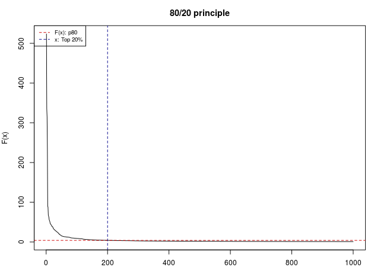

<blockquote class="blockquote">

<p class="small font-italic">

There are far more ordinary people (say, 80 percent) than extraordinary
people (say, 20 percent); this is often characterized by the 80/20
principle, based on the observation made by the Italian economist
Vilfredo Pareto in 1906 that 80% of land in Italy was owned by 20% of
the population. A histogram of the data values for these phenomena would
reveal a right-skewed or heavy-tailed distribution. How to map the data
with the heavy-tailed distribution?

</p>

<footer class="blockquote-footer" markdown="1">

Jiang (2013)[^1]

</footer>

</blockquote>

## Abstract

This vignette discusses the implementation of the “Head/tail breaks”
style (Jiang (2013)[^1]) on the `classIntervals` function of the
`classInt` package. A step-by-step example is presented in order to
clarify the method. A case study using `spData::afcon` is also included,
making use of other additional packages as `sf`.

## Introduction

The **Head/tail breaks**, sometimes referred as **ht-index** (Jiang and
Yin (2013)[^2]), is a classification scheme introduced by Jiang
(2013)[^1] in order to find groupings or hierarchy for data with a
heavy-tailed distribution.

Heavy-tailed distributions are heavily right skewed, with a minority of
large values in the head and a majority of small values in the tail.
This imbalance between the head and tail, or between many small values
and a few large values, can be expressed as *“far more small things than
large things”*.

Heavy tailed distributions are commonly characterized by a power law, a
lognormal or an exponential function. Nature, society, finance (Vasicek
(2002)[^3]) and our daily lives are full of rare and extreme events,
which are termed “black swan events” (Taleb (2008)[^4]). This line of
thinking provides a good reason to reverse our thinking by focusing on
low-frequency events.

``` r
library(classInt)

# 1. Characterization of heavy-tail distributions----
set.seed(1234)
# Pareto distribution a=1 b=1.161 n=1000
sample_par <- 1 / (1 - runif(1000))^(1 / 1.161)
opar <- par(no.readonly = TRUE)
par(mar = c(2, 4, 3, 1), cex = 0.8)
plot(
  sort(sample_par, decreasing = TRUE),
  type = "l",
  ylab = "F(x)",
  xlab = "",
  main = "80/20 principle"
)
abline(
  h = quantile(sample_par, .8),
  lty = 2,
  col = "red3"
)
abline(
  v = 0.2 * length(sample_par),
  lty = 2,
  col = "darkblue"
)
legend(
  "topleft",
  legend = c("F(x): p80", "x: Top 20%"),
  col = c("red3", "darkblue"),
  lty = 2,
  cex = 0.8
)
```

<!-- -->

``` r
hist(
  sample_par,
  n = 100,
  xlab = "",
  main = "Histogram",
  col = "grey50",
  border = NA,
  probability = TRUE
)
```

<!-- -->

``` r
par(opar)
```

## Breaking method

The method itself consists on a four-step process performed recursively until a stopping condition is satisfied. Given a vector of values $$v = (a_1, a_2, ..., a_n) $$ the process can be described as follows:


1. Compute $$\mu = \sum_{i=1}^{n} a_i $$.
2. Break $$v$$ into the $$tail$$ and the $$head$$:
$$tail = \{ a_x \in v | a_x \lt \mu \} $$ 
$$head = \{ a_x \in v | a_x \gt \mu \} $$.

3. Assess if the proportion of $$head$$ over $$v$$ is lower or equal than a given threshold:

$$\frac{|head|}{|v|} \le thresold  $$

4. If 3 is `TRUE`, repeat 1 to 3 until the condition is `FALSE` or no more partitions are possible (i.e. $$head$$ has less than two elements). 

It is important to note that, at the beginning of a new iteration, `var` is replaced by `head`. The underlying hypothesis is to create partitions until the head and the tail are balanced in terms of distribution.So the stopping criteria is satisfied when the last head and the last tail are evenly balanced. 

## References

[^1]: Jiang, Bin. 2013. "Head/Tail Breaks: A New Classification Scheme for Data with a Heavy-Tailed Distribution." *The Professional Geographer* 65 (3): 482–94. [DOI](https://doi.org/10.1080/00330124.2012.700499).
[^2]: Jiang, Bin, and Junjun Yin. 2013. "Ht-Index for Quantifying the Fractal or Scaling Structure of Geographic Features." *Annals of the Association of American Geographers* 104 (3): 530–40. [DOI](https://doi.org/10.1080/00045608.2013.834239).
[^3]: Vasicek, Oldrich. 2002. "Loan Portfolio Value." *Risk*, December, 160–62.
[^4]: Taleb, Nassim Nicholas. 2008. *The Black Swan: The Impact of the Highly Improbable.* 1st ed. London: Random House.